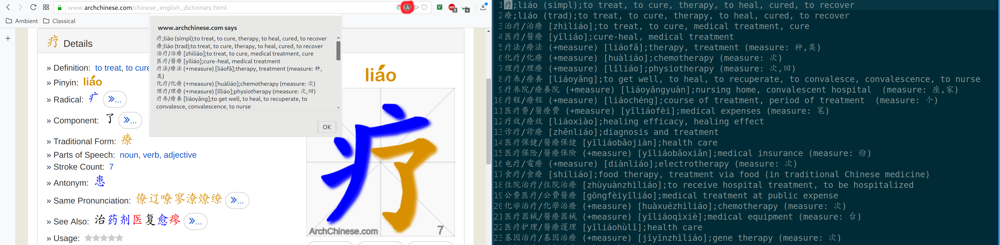

# ArchChinese Scraper Chrome Extension

### Overview

ArchChinese Scraper is a Chrome extension to scrape words and characters from the ArchChinese website, and
was originally developed to facilitate the creation of Anki decks for Chinese language learners.
Scraped text is stored on the system clipboard for ease of use.

The output of the scraper can be used in conjunction with a
[script like this](https://gist.github.com/akhouderchah/ebfc75ddbac177d0aef189da19b18920)
such that words are only added to a list when all of the characters are known.

The extension can be found [here](https://chromewebstore.google.com/detail/arch-chinese-scraper/llkdlmohpnemkfkakmcmfajeogfkkhdm).
